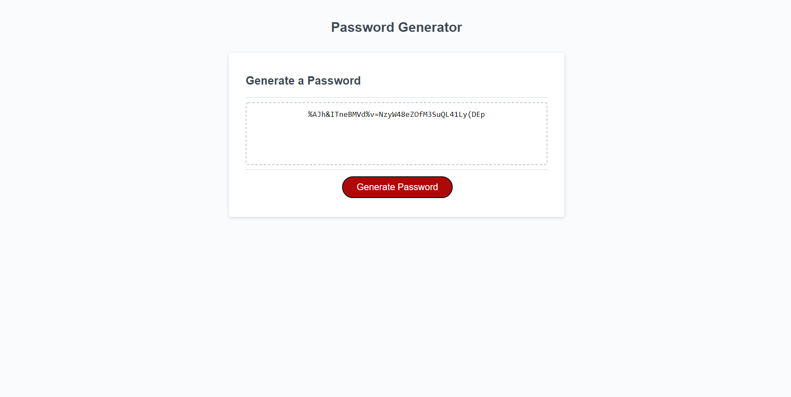

# Password_Generator
# HTML & CSS 
The HTML and the CSS are not my own code. 
# Javascript 
In the javascript I had to make mupliple arrays. One with uppercase letters, one with lowercase letters, one with symbols, and one with numbers.
There is also an empty array that will be used to store the specific characters the user chooses. 
The generation of the password begins by prompting the user how many characters they want in the password and then making sure the users input matches the given amount of characters and is an actual number which is done with a while statement. 
Then moving to the the users choice of symbols, upper and/or lowercase letters, or numbers to be in the password. This is done by using confirms. If the confirm is true the corresponding array is added to the empty array. 
There is a while statment that makes sure the user answers at least one of the confirms. 
The password is generated randomly taking the characters and symbols from the empty array. 
Below is a screenshot of a generated password that is 40 characters long with each character type. 

Below is a link to the deployed generator.

https://jacobschwal.github.io/Password_Generator/